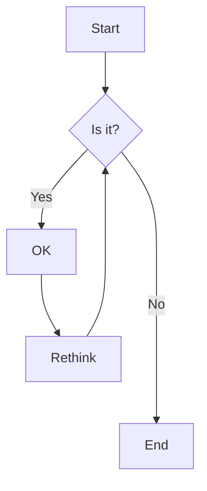
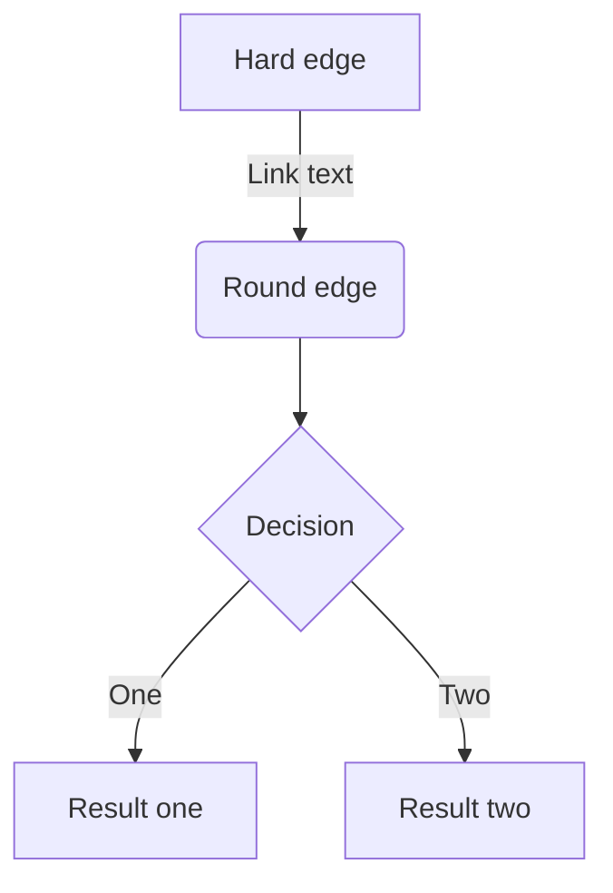
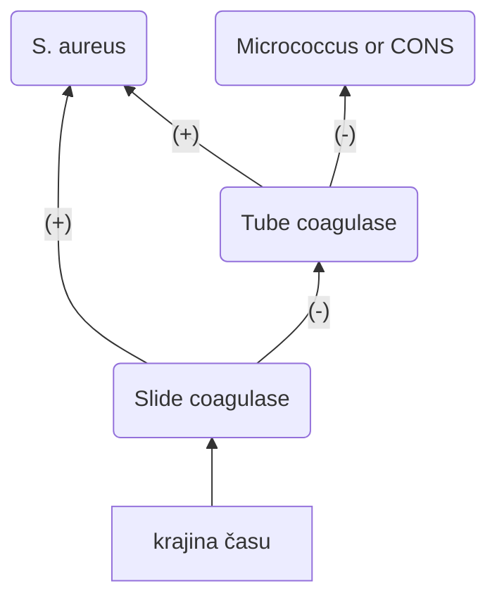
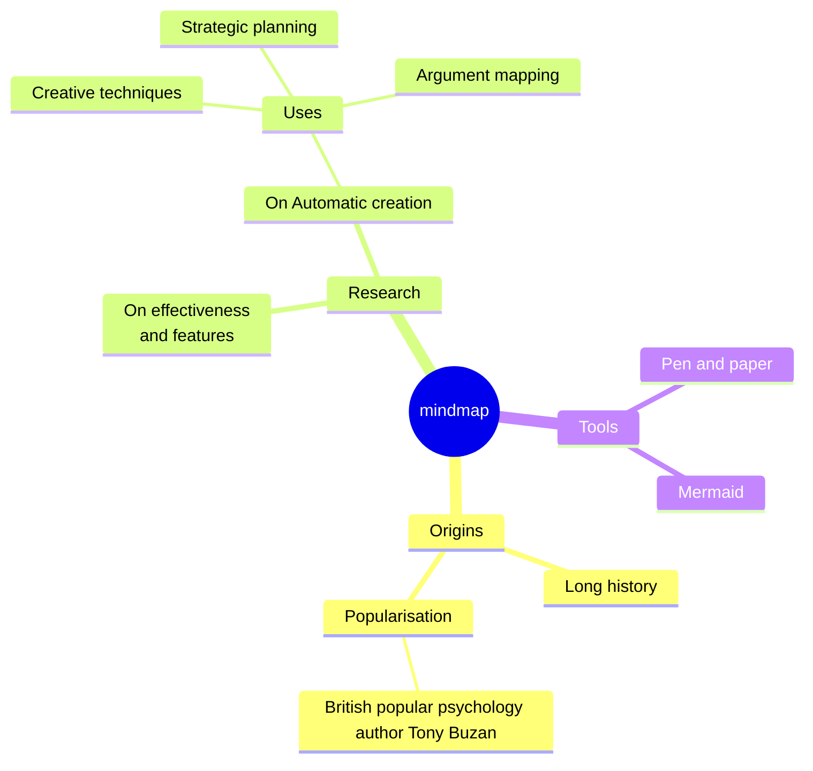
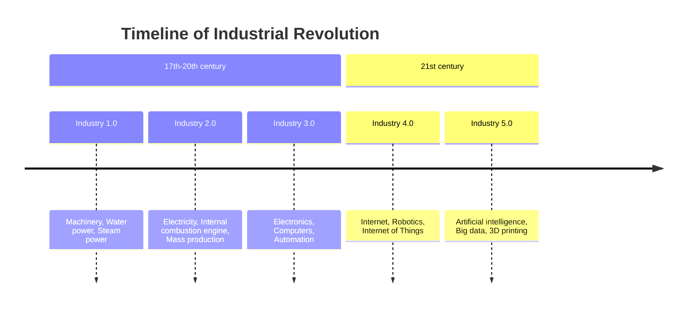

---
{"dg-publish":true,"permalink":"/loregent/assets/obsidian-help/flow-charts/","noteIcon":""}
---

### Flow Charts

V obsidiane funguje mermaid charts.
- [Flowcharts Syntax | Mermaid](https://mermaid.js.org/syntax/flowchart.html) Je tam aj syntax. Stačí ti flow
- [Advanced formatting syntax - Obsidian Help](https://help.obsidian.md/Editing+and+formatting/Advanced+formatting+syntax#Linking+files+in+a+diagram)

Possible FlowChart orientations are:

- TB - Top to bottom
- TD - Top-down/ same as top to bottom
- BT - Bottom to top
- RL - Right to left
- LR - Left to right

---

[Flowcharts Syntax | Mermaid](https://mermaid.js.org/syntax/flowchart.html) 
- class A,B,C,D,E,F,G,H,I,J,K,L,M,N,O,P,Q,R,S,T,U,V,W,X,Y,Z internal-link == všetko má linky
- class meno internal-link == iba jedna vec má link

---

[Mindmap | Mermaid](https://mermaid.js.org/syntax/mindmap.html)

---

[Timeline Diagram | Mermaid](https://mermaid.js.org/syntax/timeline.html)

---

### LINK : 
[[LOREGENT/Assets/Structure/Map of content/MOC - Obsidian Help\|MOC - Obsidian Help]]